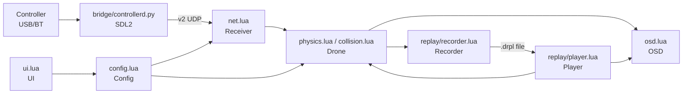

# Architecture

System-level overview of how the pieces fit together. For *why* specific
non-obvious decisions were made (camera orientation, physics tuning,
collision handling, the replay format, motor audio, the controller
protocol), see the deep-dive docs under [`drone/docs/`](drone/docs/) —
this document covers *what talks to what*.

## Overview

## Entry point

`drone.lua` is a thin MoonLoader entry-point: it extends `package.path` to
resolve `require()` calls against `drone/`, constructs one instance of each
class below, and runs the main tick loop that wires them together (poll
input → step physics or replay playback → capture a replay frame → draw the
OSD). No flight/replay/UI logic lives here.

## Modules

- **`drone/bridge/controllerd.py`** — a standalone Python daemon, reads any
  connected joystick/gamepad via SDL2 and broadcasts UDP packets. See
  [`drone/docs/controller-bridge.md`](drone/docs/controller-bridge.md).
- **`drone/protocol.lua`** — the UDP packet format (FFI struct) and parser.
- **`drone/net.lua`** (`Receiver`) — owns the UDP socket, tracks every
  connected controller, and resolves which one is actively driving the
  drone (auto or manually picked from the menu).
- **`drone/config.lua`** (`Config`) — drone profiles (mass/thrust/drag/etc.)
  and all other settings; JSON-persisted.
- **`drone/drone.lua`** + **`drone/physics.lua`** + **`drone/collision.lua`**
  (`Drone`) — the drone entity itself: pose, the flight model (ACRO/LEVEL/
  HORIZON/3D-throttle), the per-frame vehicle-matrix write that drives it,
  and collision/crash handling. Split across three files, one shared class.
- **`drone/camera.lua`** — the small per-tick camera-state fixup the FPV
  view needs (see `drone/docs/orientation.md` for why the camera itself
  needs almost no code beyond this).
- **`drone/audio.lua`** (`MotorAudio`) — motor hum via BASS, pitch/volume
  driven by throttle and distance.
- **`drone/replay/format.lua`** — the `.drpl` file format (FFI structs),
  shared by the recorder and player.
- **`drone/replay/recorder.lua`** (`Recorder`) — captures every flight into
  a fixed-size ring buffer (no per-tick allocation) and saves it to disk.
- **`drone/replay/player.lua`** (`Player`) — loads a saved flight and drives
  the drone and background entities from it, VLC-style (play/pause/speed/seek).
- **`drone/osd.lua`** (`OSD`) — all on-screen display drawing, reading from
  one telemetry table populated identically whether flying live or watching
  a replay.
- **`drone/sp.lua`** (`SPExtras`) — singleplayer-only extras: player
  protection during flight, police shoot-down damage watch, population
  density/limit boost. Every effect is a no-op in SAMP.
- **`drone/font.lua`** — one-time auto-download and hot-swap of the menu font.
- **`drone/ui.lua`** (`UI`) — the mimgui settings window (profiles, general
  settings including the controller picker, and the replay browser/player controls).

## Data flow per tick

1. `Receiver:poll()` drains the UDP socket, updates the live device list,
   and applies axes/buttons from whichever device is currently selected.
2. If a replay is active, `Player:tick()` drives `Drone`'s pose from the
   recorded frame instead of `Drone:updatePhysics()`.
3. Otherwise, `Drone:updatePhysics()` steps the flight model, then
   `Drone:checkCollision()`/`:crash()` handle any impact.
4. `Drone:applyTransform()` writes the resulting pose into the game's
   vehicle matrix every tick, live or replayed alike.
5. `Recorder:captureFrame()` appends the current pose (skipped during
   replay playback — a replay doesn't re-record itself).
6. `OSD:draw()` reads the same telemetry table regardless of source.

## Why this split

Each class owns its own state as `self.*` and receives its dependencies as
explicit constructor/method parameters (`Recorder:captureFrame(drone,
connected)`, not a shared module-level global) — deliberately, so a bug in
one system can't silently depend on load order or hidden state in another.
