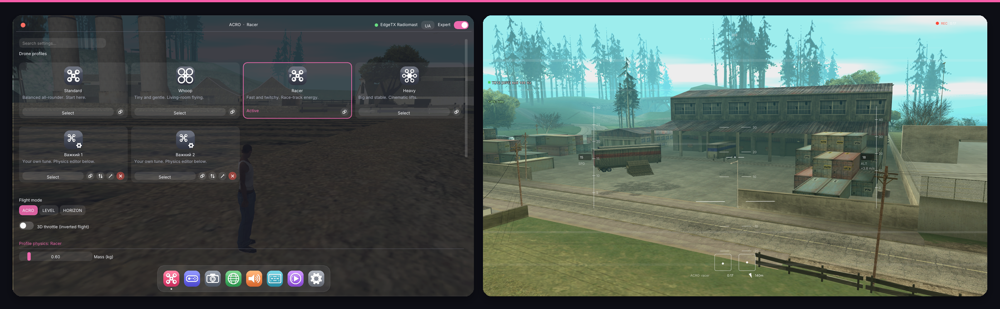

# GTA FPV Drone

A fully scripted FPV drone for GTA San Andreas (MoonLoader) — spawn a
quadcopter, freeze your character in place, and fly it FPV-style with real
flight physics, flown from **any connected controller** (RC transmitter,
DualSense, Xbox pad, generic joystick). Works in both singleplayer and SA-MP.

## Features

- **Real flight physics** — thrust, gravity, anisotropic drag, motor spool
  lag, ground/ceiling effect, optional wind/turbulence — not GTA's own
  vehicle physics, so full flips and inverted flight work.
- **Three flight modes**: ACRO (direct rate control), LEVEL (self-leveling),
  HORIZON (blends both by stick deflection) — plus an optional bidirectional
  3D-throttle mode. Switchable by keyboard or a controller button.
- **Flight recorder + VLC-style replay**: records every flight (drone pose
  + nearby vehicles/peds/objects) to a fixed-memory ring buffer, save to
  disk, and play it back with speed control, scrubbing, and the game's own
  in-vehicle camera (including the `V` camera cycle).
- **Four OSD styles**: Classic (text readout), Skyline (clean white HD
  horizon + tapes), Recon (mono-green analog-camera look), Circuit
  (race-sim grid/crosshair/boxed readouts) — plus a color-coded drone HP
  indicator, signal-strength static effect, and flight timer.
- **A settings menu built for it**: glass window, macOS-style dock
  navigation, drone-status bar, live settings search, first-run setup
  wizard (controller detection, calibration, graphical deadzone tuning),
  and profile cards you can duplicate/rename/share as plain text.
- **Motor audio** with live pitch/volume from throttle and distance.
- **Any controller** — RC transmitters and modern gamepads alike, selected
  live from the in-game menu; plug in more than one and switch anytime.
- **Configurable drone profiles** (whoop / racer / heavy / default, or your
  own) — mass, thrust, drag, rates all editable live.

## Quick start

1. Run the installer for your OS from `installer/`:
   - Linux: `./installer/install.sh`
   - Windows: right-click `installer/install.ps1` → *Run with PowerShell*
     (or `powershell -ExecutionPolicy Bypass -File installer/install.ps1`)
2. Follow the prompts — it asks for your GTA San Andreas folder, checks for
   the MoonLoader libraries this script needs (and tells you exactly what's
   missing and where to get it, all at once), and sets up the controller
   bridge.
3. Plug in a controller, launch the game, type `DRONE` in chat/console to
   spawn (default cheat phrase — throttle must be near zero, like a real
   arm sequence), and `CFGD` to open the settings menu.

See the installer's own summary output for the exact command to start the
controller bridge if you chose manual startup.

### Manual install

If you'd rather not use the installer: copy `drone.lua` and the `drone/`
folder into `<your GTA SA folder>/moonloader/`, then run
`uv run drone/bridge/controllerd.py` ([get uv](https://docs.astral.sh/uv/getting-started/installation/)
if you don't have it — it installs the bridge's one dependency
automatically on first run) whenever you want to fly. See
[`drone/bridge/README.md`](drone/bridge/README.md).

## Default controls

| Action | Default |
|---|---|
| Spawn/despawn drone | type `DRONE` |
| Open settings menu | type `CFGD` |
| Arm/disarm motors | `X` |
| Recall (teleport back to you) | `R` |
| Cycle ACRO/LEVEL/HORIZON | `M` |
| Toggle 3D throttle | `N` |
| Save current flight replay | `J` |

All keybinds and the cheat phrases themselves are rebindable from the menu.

## Dependencies

This is a MoonLoader script — it assumes you already have (or the
installer will tell you exactly what to get):

- [MoonLoader](https://blast.hk/moonloader/) itself — config file I/O and
  replay file listing use MoonLoader's own native `decodeJson`/`encodeJson`
  and `findFirstFile`/`findNextFile`, no separate JSON or filesystem
  library needed
- [mimgui](https://github.com/THE-FYP/mimgui) — the settings menu
- SAMemory — direct memory access for the vehicle/camera matrix writes
  (search blast.hk's MoonLoader library section; no single canonical link
  found for this one)
- `luasocket` — UDP (controller bridge, both scripts' receivers)
- `bass.lua` + `bass.dll` — motor audio, via the
  [BASS audio library](https://www.un4seen.com/) (free for non-commercial use)
- [`uv`](https://docs.astral.sh/uv/getting-started/installation/) — runs
  the controller bridge daemon (`drone/bridge/controllerd.py`); its one
  Python dependency (`pysdl2`) is declared inline and installed
  automatically on first run

**Wine/Proton note**: mimgui (and the older `imgui.lua` many other scripts
use) hard-requires `C:\windows\Fonts\trebucbd.ttf` (Trebuchet MS Bold) and
dies with a font assert if the Wine prefix doesn't have it — fresh Proton
prefixes don't. This mod handles it automatically: if the file is missing
at startup, the bundled Inter.ttf is planted under that path (mimgui loads
whatever bytes live there), so every imgui-based script in the game starts
normally. Installing real corefonts (`winetricks corefonts`) also works if
you prefer the authentic font.

**Update notices**: on startup the script checks `drone/VERSION` (the
commit hash it was released at) against the same file on GitHub's `main`
branch, and shows a small dismissible banner in the settings menu if a
newer commit exists. No auto-update, no telemetry beyond that one file
fetch, silently does nothing if you're offline.

## How it's built

See [`ARCHITECTURE.md`](ARCHITECTURE.md) for a system-level overview, and
[`drone/docs/`](drone/docs/) for design write-ups on specific tricky parts
(camera orientation, the physics model, collision handling, the replay
format, motor audio, the controller bridge).

## License

This project's own code is MIT — see [`LICENSE`](LICENSE). The bundled
Inter font is SIL Open Font License 1.1 — see
[`drone/resources/Inter-OFL.txt`](drone/resources/Inter-OFL.txt). Third-party
MoonLoader libraries listed above are not bundled and keep their own licenses.

